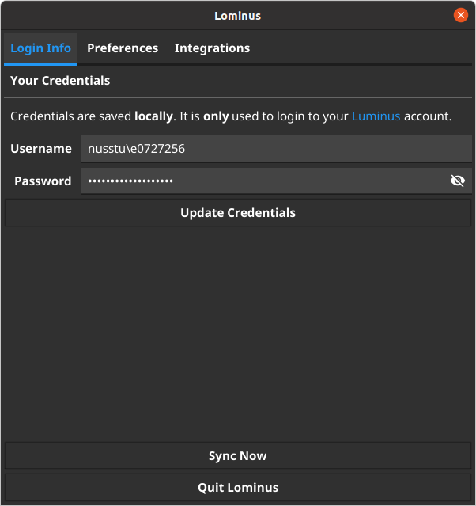
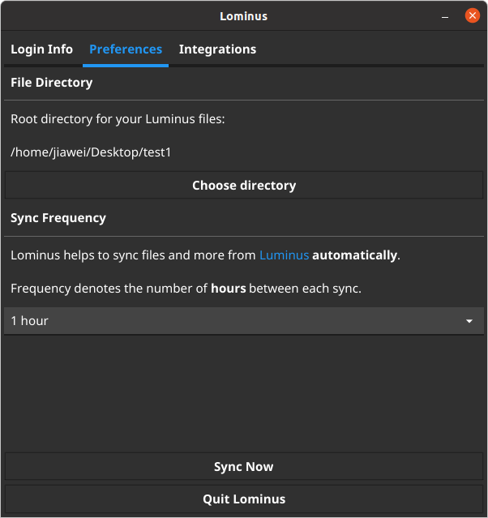
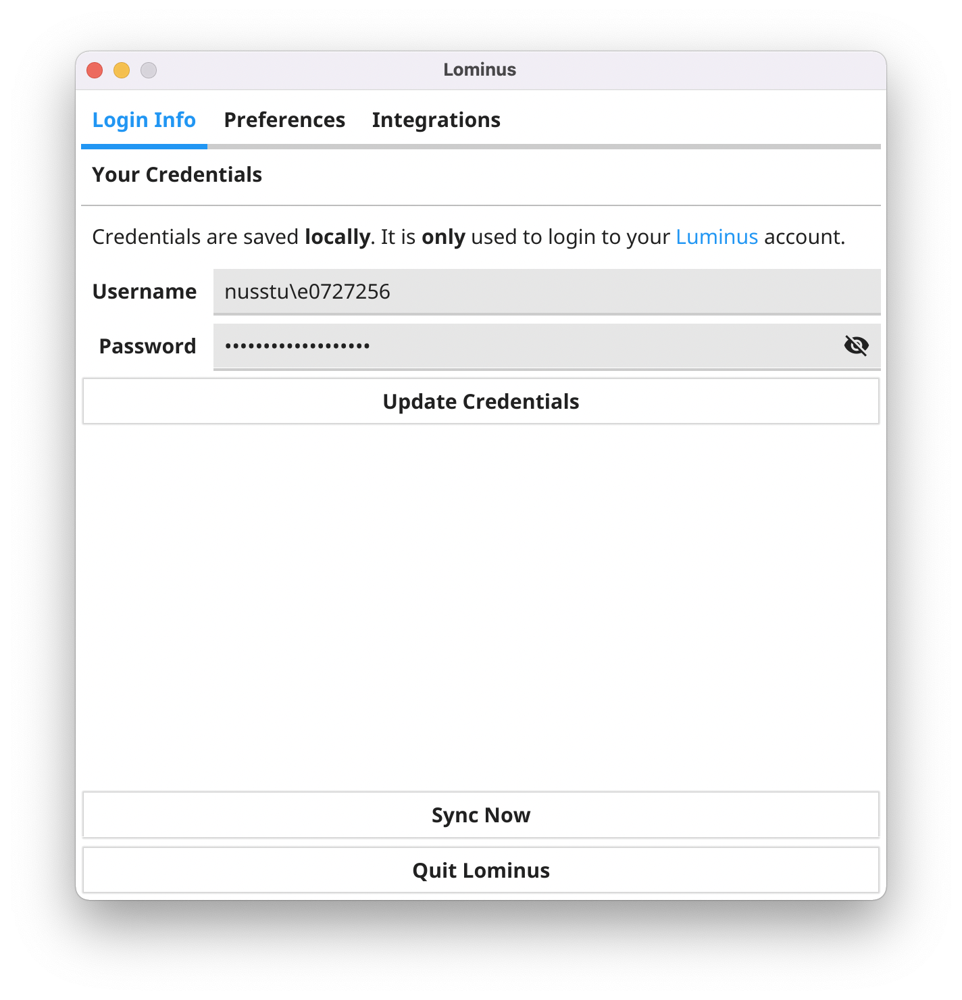
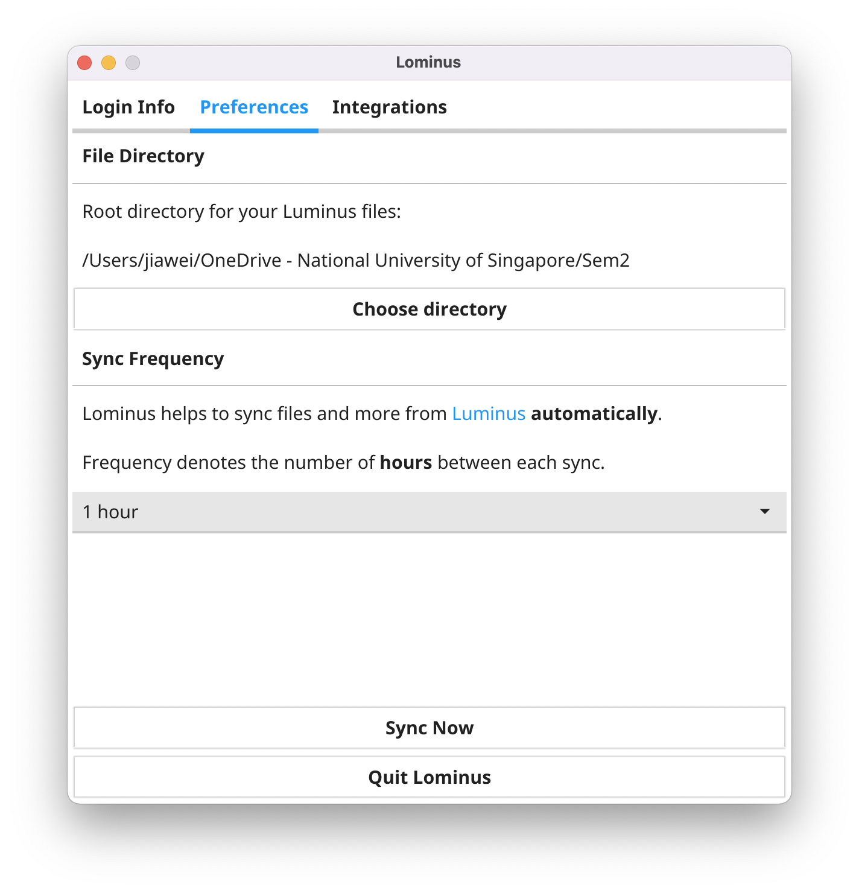
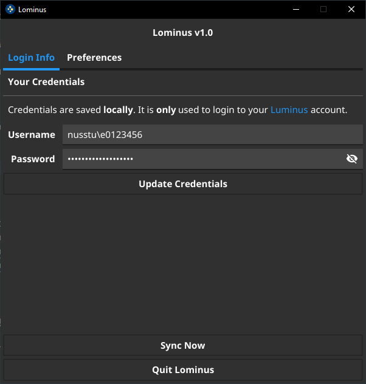
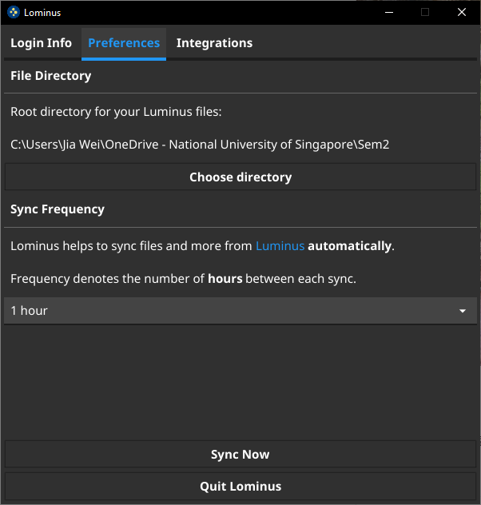

<p align="center">
  
</p>

<p align="center">
  
  
  
  <a href="https://pkg.go.dev/github.com/beebeeoii/lominus">
    
  </a>
</p>

# Table of Contents

1. [About](#about)
2. [Features](#features)
3. [Getting Started](#getting-started)
    - [Installation](#getting-started-installation)
        - [Windows](#getting-started-installation-windows)
        - [macOS](#getting-started-installation-mac)
        - [Linux](#getting-started-installation-linux)
    - [Building](#getting-started-building)
        - [Pre-requisites](#getting-started-building-prerequisites)
        - [Build](#getting-started-building-build)
    - [API](#getting-started-api)
        - [Example: Retrieving modules](#getting-started-api-example)
        - [Example: Sample Output](#getting-started-api-example-output)
4. [Integrations](#integrations)
5. [Screenshots](#screenshots)
6. [Contributing](#contributing)

# About <a name="about">

Lominus is a tool written in Go to automatically sync [Luminus](https://luminus.nus.edu.sg) and [Canvas](https://canvas.nus.edu.sg/) files onto your local storage for easy access to updated files. It runs on Windows, macOS and Linux.

**No credentials, files, or any other form of information is uploaded to any servers. Everything is stored locally on your system. Credentials are only used for authentication.**

# Features <a name="features">

Lominus removes the hassle to download (or redownload) whenever files are uploaded (or updated). And many more!

- Works with Canvas (New !)
- Keeps files updated and organised
- Automatic download of module files
- Automatic update of module files when files are reuploaded
- System notifications
- System-based dark/light mode
- System tray icon
- Telegram integration
- API

# Getting Started <a name="getting-started">

## Installation <a name="getting-started-installation">

Unsigned standalone executables for Windows, macOS and Linux are available from [releases](https://github.com/beebeeoii/lominus/releases).

**Note**: Please read through installation introduction for the respective operating systems below.

### Windows <a name="getting-started-installation-windows">

> Tested on Windows 10 Home Version 10.0.19044 Build 19044

Your anti-virus software like Windows Defender may prompt that `lominus.exe` as a false positive. You may need to make an exception for it.

This occurs because the app is unsigned amongst other reasons regarding Go executables which you may find out more [here](https://go.dev/doc/faq#virus). Signing it requires a valid certificate which is payable.

### macOS <a name="getting-started-installation-mac">

> Tested on M1 MacBook Air 2020 macOS Monterey Version 12.1

You may receive the prompt

> “Lominus” is damaged and can’t be opened. You should eject the disk image.

or

> The app is from an unidentified developer.

This happens because the app is unsigned. Signing it requires a valid certificate which requires a valid Apple Developer Program membership.

To enable exception for this app

``` bash
xattr -cr [filepath]
```

where `[filepath]` is the path to the `.dmg` file.

### Linux <a name="getting-started-installation-linux">

> Tested on Ubuntu Focal 20.04.2 LTS and Arch

Download and extract the tarball

``` bash
tar -xf [filename].tar.xz
```

Install the application

``` bash
sudo make install
```

## Building <a name="getting-started-building">

### Prerequisites <a name="getting-started-building-prerequisites">


1. [Golang](https://go.dev/dl/)

2. `gcc`

3. `gtk3` and `libayatana-appindicator3-dev` (Linux)

    - For Debian and Ubuntu, you may install these via

        ``` bash
        sudo apt-get install gcc libgtk-3-dev libayatana-appindicator3-dev
        ```

    - If you are on Linux Mint, you will require `libxapp-dev` as well.

### Build <a name="getting-started-building-build">

1. Ensure Go is set in you system env var

2. Install dependencies in the directory where you cloned

    ``` bash
    go install
    ```


3. Install [fyne](https://developer.fyne.io/index.html)

    ``` bash
    go get fyne.io/fyne/v2/cmd/fyne
    ```

4. Finally, build and compile

    ``` bash
    fyne package
    ```

## API <a name="getting-started-api">

Lominus can also be used as an API. Please visit [documentations](https://pkg.go.dev/github.com/beebeeoii/lominus) for more details.

### Example: Retrieving your modules <a name="getting-started-api-example">

```go
package main

import (
    "log"

    "github.com/beebeeoii/lominus/pkg/api"
    "github.com/beebeeoii/lominus/pkg/auth"
    "github.com/beebeeoii/lominus/pkg/constants"
)

func getLuminusModules() {
    jwtToken, jwtTokenErr := auth.RetrieveJwtToken(auth.LuminusCredentials{
        Username: "nusstu\\e0123456",
        Password: "password",
    }, false)

    if jwtTokenErr != nil {
        log.Fatalln(jwtTokenErr)
    }

    modulesReq, modReqErr := api.BuildModulesRequest(jwtToken, constants.Luminus)
    if modReqErr != nil {
        log.Fatalln(modReqErr)
    }

    modules, modulesErr := modulesReq.GetModules()
    if modulesErr != nil {
        log.Fatalln(modulesErr)
    }

    for _, module := range modules {
        log.Println(module.ModuleCode, module.Name)
    }
}

func getCanvasModules() {
    canvasToken := "your-canvas-token"

    modulesReq, modReqErr := api.BuildModulesRequest(canvasToken, constants.Canvas)
    if modReqErr != nil {
        log.Fatalln(modReqErr)
    }

    modules, modulesErr := modulesReq.GetModules()
    if modulesErr != nil {
        log.Fatalln(modulesErr)
    }

    for _, module := range modules {
        log.Println(module.ModuleCode, module.Name)
    }
}

```

### Sample output <a name="getting-started-api-example-output">

``` terminal
2021/12/09 12:51:49 CP1002 School of Computing Placement Test: Programming Methodology
2021/12/09 12:51:49 CS2100 Computer Organisation
2021/12/09 12:51:49 IDRES2021 Advancing Interdisciplinary Education in Singapore
2021/12/09 12:51:49 IS1103 Ethics in Computing
2021/12/09 12:51:49 MA2001 Linear Algebra I
2021/12/09 12:51:49 MA2002 Calculus
2021/12/09 12:51:49 SOCT101 SoC Teaching Workshop
```

# Integrations <a name="integrations">

## Telegram

Telegram can be used to receive notifications for things such as new grades releases.

### Setting up


1) Create a bot via [BotFather](https://telegram.me/BotFather). Take note of the _bot token_.

2) **_Important_**: Drop the bot you have just created a message to enable it to message you.

3) Retrieve your _Telegram user ID_. The simplest way is via [UserInfoBot](https://telegram.me/userinfobot).

4) Copy and paste the _bot token_ and your _Telegram user ID_ in Lominus, under the Integrations tab.

5) Save and you should receive a test message from your bot.

# Screenshots <a name="screenshots">

Click [here](./screenshots/SCREENSHOTS.md) for more screenshots

Login Info             |  Preferences
:-------------------------:|:-------------------------:
  |  
  |  
  |  

# Contributing <a name="contributing">

Lominus is far from perfect. All contributions, regardless large or small, are highly encouraged as this would help to make Lominus better. Please submit an [issue](https://github.com/beebeeoii/lominus/issues) or fork this repo and submit a [pull request](https://github.com/beebeeoii/lominus/pulls) if necessary.

# FAQ

1. I am unable to verify my Luminus login credentials.

    - Please ensure that you have trusted the SSL Certificate used by Luminus, **especially on Unix systems**.

2. Will my annotated lecture notes be overwritten if there exists a newer version uploaded by the Professor?

    - Your annotated file will be renamed to `[v1] XXX.XXX` and the newer version will be downloaded.
