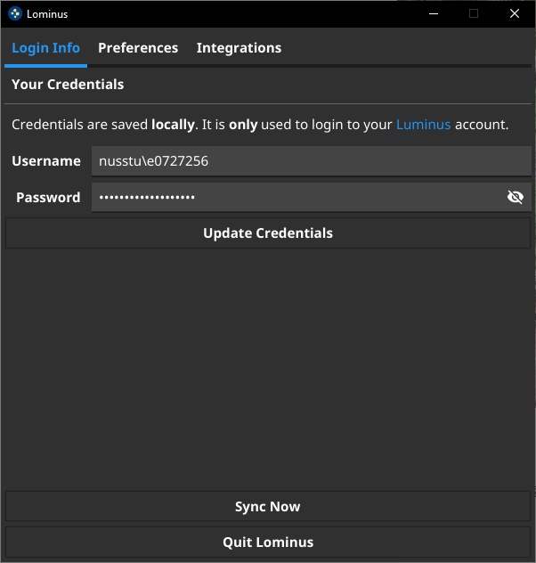

# Table of Contents

1. [About](#about)
2. [Features](#features)
3. [Getting Started](#getting-started)
    - [Installation](#getting-started-installation)
        - [Windows](#getting-started-installation-windows)
        - [macOS](#getting-started-installation-mac)
        - [Linux](#getting-started-installation-linux)
    - [Building](#getting-started-building)
        - [Pre-requisites](#getting-started-building-prerequisites)
        - [Build](#getting-started-building-build)
    - [API](#getting-started-api)
        - [Example: Retrieving modules](#getting-started-api-example)
        - [Example: Sample Output](#getting-started-api-example-output)
5. [Screenshots](#screenshots)
6. [Contributing](#contributing)

# About <a name="about">

Lominus is a tool written in Go to automatically sync [Luminus](https://luminus.nus.edu.sg) files onto your local storage for easy access at a fixed interval of your choice. It is designed to run on Windows, macOS and Linux operating systems.

**No credentials, files, or any other form of information is uploaded to any servers. Everything is stored locally on your system. Credentials are only used to authenticate with [Luminus](https://luminus.nus.edu.sg).**

# Features <a name="features">

Lominus removes the hassle to download (or redownload) whenever files are uploaded (or updated), resulting in necessary manual cleanup and organisation of the files. And many more!

- Keeps your Luminus files organised
- Automatic download of all files from Luminus Files for all modules
- Automatic update of files when files are reuploaded on Luminus
- System notification sync status
- Dark/light mode (based on your system's theme)
- System tray icon (Windows only)

To be implemented:

- Notification when new grades are released in gradebooks
- User-defined webhook for Telegram/Notion/custom integrations

# Getting Started <a name="getting-started">

## Installation <a name="getting-started-installation">

Standalone programs for Windows, macOS and Linux are available. Download the program from [releases](https://github.com/beebeeoii/lominus/releases).

### Windows <a name="getting-started-installation-windows">

Windows Defender might prompt that `lominus.exe` is a malware/virus (especially if you downloaded it using Microsoft Edge). Please try to use another browser. If the issue persists, please create an [issue](https://github.com/beebeeoii/lominus/issues).

This occurs because the app is unsigned. Signing it requires a valid certificate which is payable.

### macOS <a name="getting-started-installation-mac">

You may receive the prompt

> “Lominus” is damaged and can’t be opened. You should eject the disk image.

Execute `xattr -cr [filepath]` where `[filepath]` is the path to the `.dmg` file that you downloaded.

This happens because the app is unsigned. Signing it requires a valid certificate which requires a valid Apple Developer Membership.

### Linux <a name="getting-started-installation-linux">

Linux is probably the best operating system here... You can probably get it running as a Linux user ;)

## Building <a name="getting-started-building">

You may choose to clone and compile the program for your operating system manually.

### Prerequisites <a name="getting-started-building-prerequisites">

1. [Go](https://go.dev/dl/)

2. `gcc`

3. `gtk3` and `libappindicator3` (Linux)

    - For Debian and Ubuntu, you may install these via `sudo apt-get install gcc libgtk-3-dev libappindicator3-dev`

    - If you are on Linux Mint, you will require `libxapp-dev` as well.

### Build <a name="getting-started-building-build">

1. Ensure Go is set in you system env var.

2. Navigate to the directory where you cloned and execute `go install`.

3. Install [fyne](https://developer.fyne.io/index.html) via `go get fyne.io/fyne/v2/cmd/fyne`

4. Finally, build and compile. Depending on your system os:

    - For windows: `fyne package -os windows`.

    - For macOS: `fyne package -os darwin`.

    - For Linux: `fyne package -os linux`.

## API <a name="getting-started-api">

Lominus can also be used as an API. Please visit documentations (coming soon) for more details.

### Example: Retrieving your modules <a name="getting-started-api-example">

```go
package main

import (
    "log"

    "github.com/beebeeoii/lominus/pkg/api"
    "github.com/beebeeoii/lominus/pkg/auth"
)

func main() {
    credentials := auth.Credentials{
        Username: "nusstu\\e0123456",
        Password: "p455w0rd",
    }

    _, err := auth.RetrieveJwtToken(credentials, true)
    if err != nil {
        log.Fatalln(err)
    }

    moduleRequest, modReqErr := api.BuildModuleRequest()
    if modReqErr != nil {
        log.Fatalln(modReqErr)
    }

    modules, modErr := moduleRequest.GetModules()
    if modErr != nil {
        log.Fatalln(modErr)
    }

    for _, module := range modules {
        log.Println(module.ModuleCode, module.Name)
    }
}
```

### Sample output <a name="getting-started-api-example-output">

``` terminal
2021/12/09 12:51:49 CP1002 School of Computing Placement Test: Programming Methodology
2021/12/09 12:51:49 CS2100 Computer Organisation
2021/12/09 12:51:49 IDRES2021 Advancing Interdisciplinary Education in Singapore
2021/12/09 12:51:49 IS1103 Ethics in Computing
2021/12/09 12:51:49 MA2001 Linear Algebra I
2021/12/09 12:51:49 MA2002 Calculus
2021/12/09 12:51:49 SOCT101 SoC Teaching Workshop
```

# Screenshots <a name="screenshots">

Login Info             |  Preferences
:-------------------------:|:-------------------------:
  |  
  |  
  |  

# Contributing <a name="contributing">

Lominus is far from perfect. All contributions, regardless large or small, are highly encouraged as this would help to make Lominus better. Please submit an [issue](https://github.com/beebeeoii/lominus/issues) or fork this repo and submit a [pull request](https://github.com/beebeeoii/lominus/pulls) if necessary.

# FAQ

1. I am unable to verify my Luminus login credentials.

    - Please ensure that you have trusted the Certificate used by Luminus, **especially on macOS**.

2. Windows Defender detected `lominus.exe` as a malware/virus.

    - We have only encountered this issue when downloading with Microsoft Edge. We are certain that this is an error on Microsoft's end and have submitted a report. Please try to download with other browsers such as Chrome or Firefox.
