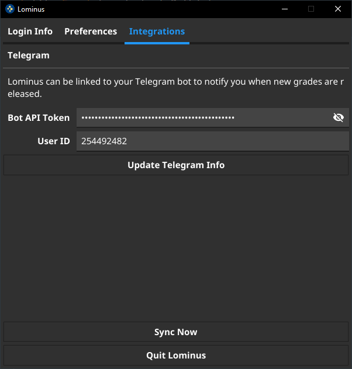
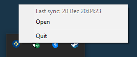
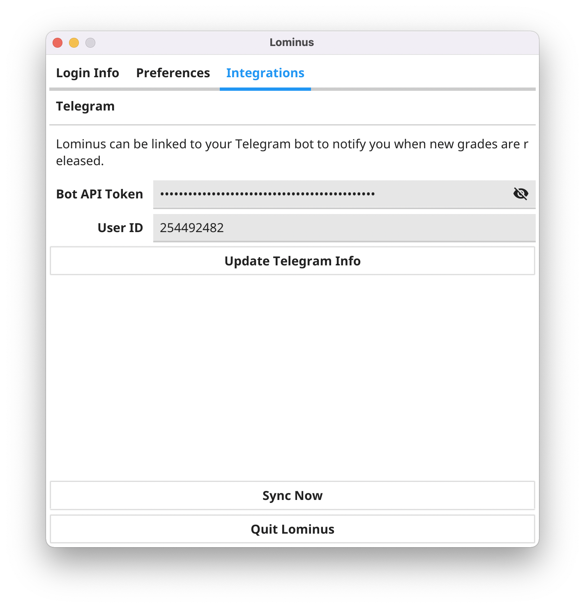
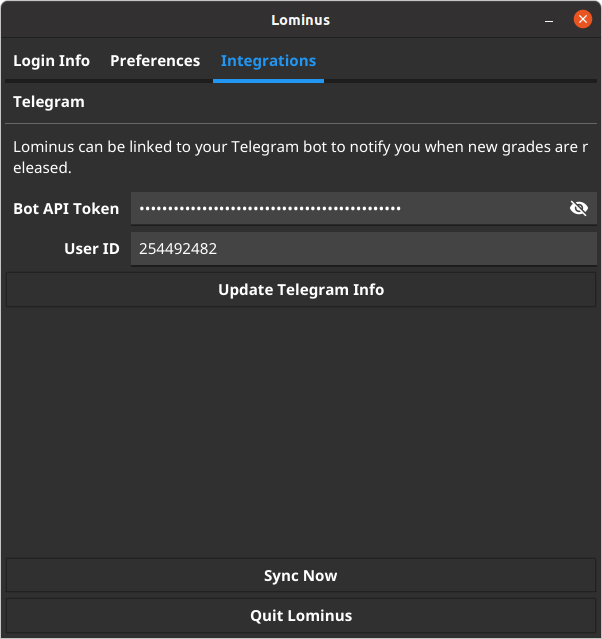
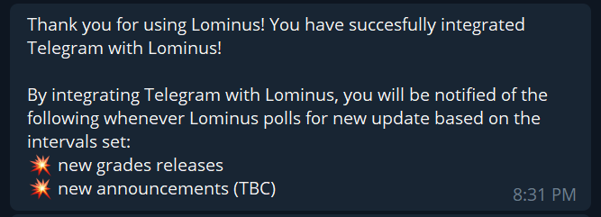
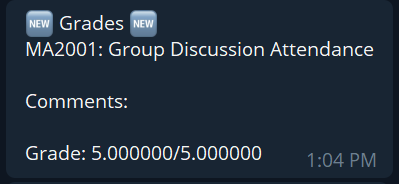

# Screenshots

## Windows

*Login Info*

*Preferences*

*Integrations*

*System Tray*

## macOS

*Login Info*

*Preferences*

*Integrations*

## Ubuntu GNOME

*Login Info*

*Preferences*

*Integrations*

## Telegram

*Integration test message*

*Sample grade notification message*
