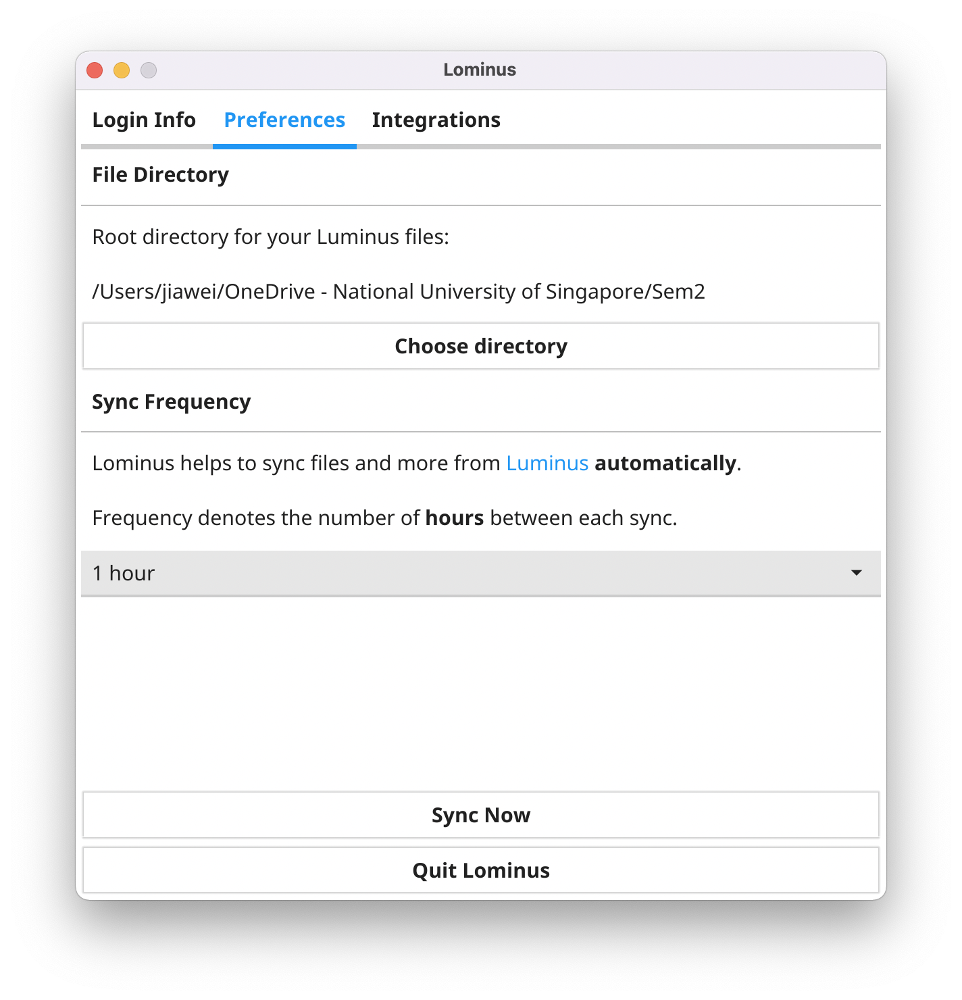

# Screenshots

1. [Windows](#win)
2. [macOS](#mac)
3. [Ubuntu](#ubuntu)
4. [Telegram](#telegram)

## Windows <a name="win">

||
|:--:|
|*Login Info*|

||
|:--:|
|*Preferences*|

||
|:--:|
|*Integrations*|

||
|:--:|
|*System Tray*|

## macOS <a name="mac">

||
|:--:|
|*Login Info*|

||
|:--:|
|*Preferences*|

||
|:--:|
|*Integrations*|

## Ubuntu <a name="ubuntu">

||
|:--:|
|*Login Info*|

||
|:--:|
|*Preferences*|

||
|:--:|
|*Integrations*|

## Telegram <a name="telegram">

||
|:--:|
|*Integration test message*|

||
|:--:|
|*Sample grade notification message*|
